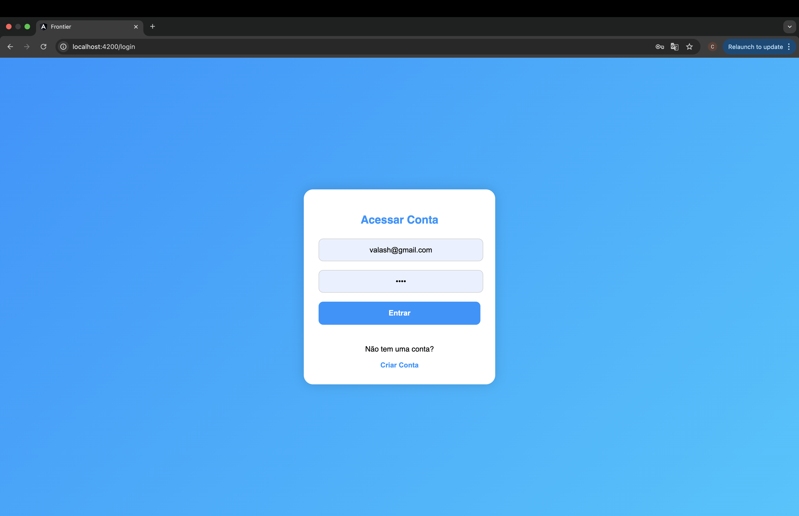
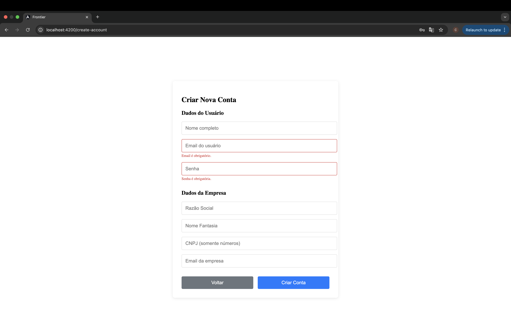
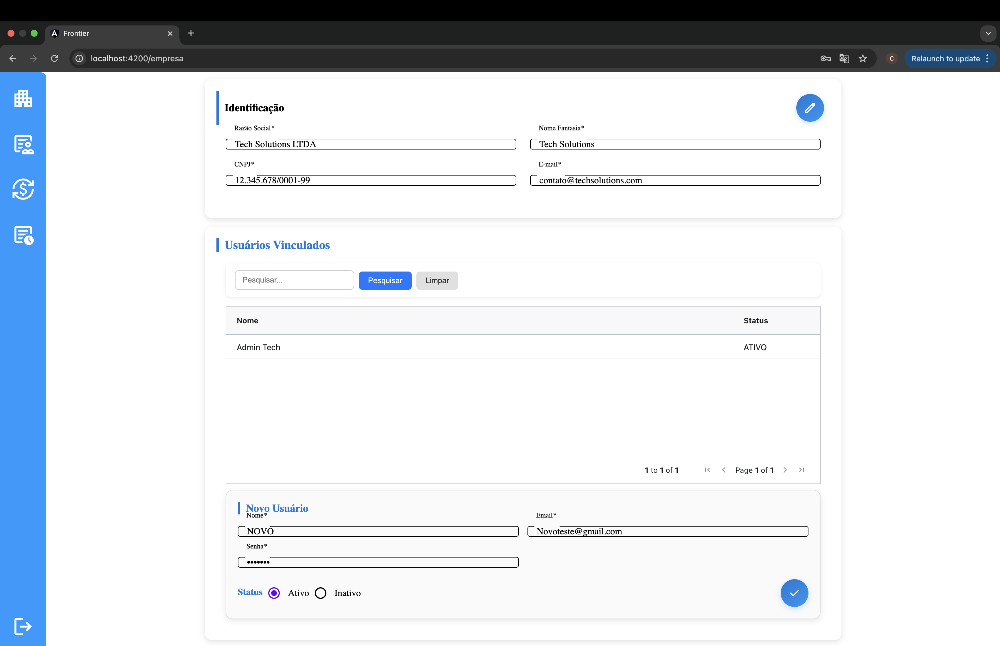
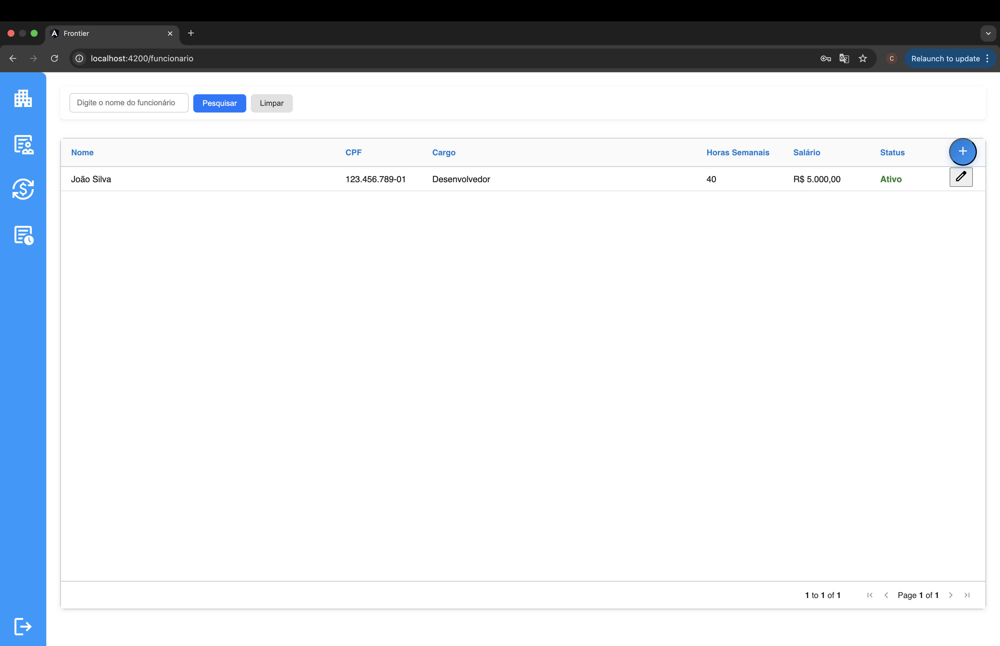
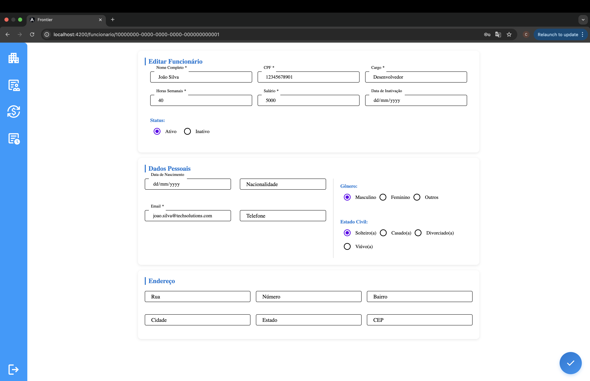
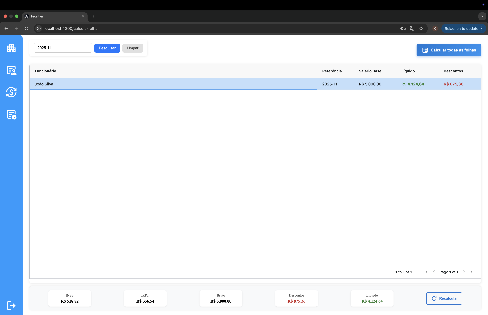
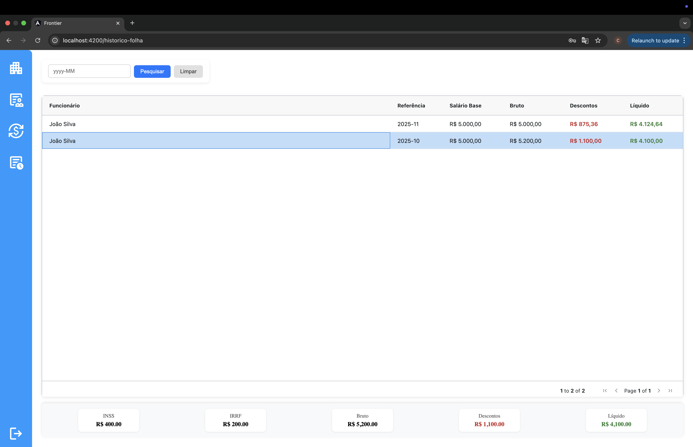

# Frontier

Sistema simples e moderno para gestão de RH desenvolvido em Angular 15.

## Como rodar

**Pré-requisitos:** Node.js 16+ e Angular CLI

1. **Instale as dependências:**

```bash
npm install
```

2. **Execute o projeto:**

```bash
ng serve
```

3. **Acesse:** http://localhost:4200

## Acesso ao Sistema

Para testar o sistema, utilize as seguintes credenciais:

- **Usuário:** Admin Tech
- **E-mail:** admin.tech@techsolutions.com
- **Senha:** senha123

## Funcionalidades

- **Autenticação** - Login seguro e criação de contas
- **Funcionários** - Cadastro, listagem e busca de funcionários
- **Empresas** - Gestão de dados corporativos
- **Folha de Pagamento** - Cálculo automático de salários
- **Histórico** - Consulta de folhas anteriores

## Screenshots

### Tela de Login



### Tela de criação de conta



### Dados empresa / controle de usuarios



### Gestão de Funcionários



### Cadastro de Funcionário



### Folha de Pagamento



### Historico da folha



## Stack

- **Frontend:** Angular 15 + TypeScript
- **UI:** Angular Material + AG-Grid
- **Navegação:** Sidebar com ícones Material Design
- **Tabelas:** AG-Grid com paginação e filtros

## Estrutura

```
src/app/
├── auth/           # Login e cadastro
├── modules/        # Módulos principais
│   ├── funcionario/
│   ├── empresa/
│   └── calcula-folha/
└── toolbar/        # Navegação lateral
```

## Repositório Backend

Este é o frontend do sistema. O backend está disponível em:

**🔗 Backend API:** [Repositório Backend](https://github.com/CristianGluchak/FrontierBack)

> **Nota:** Certifique-se de que o backend esteja rodando para o funcionamento completo do sistema.
